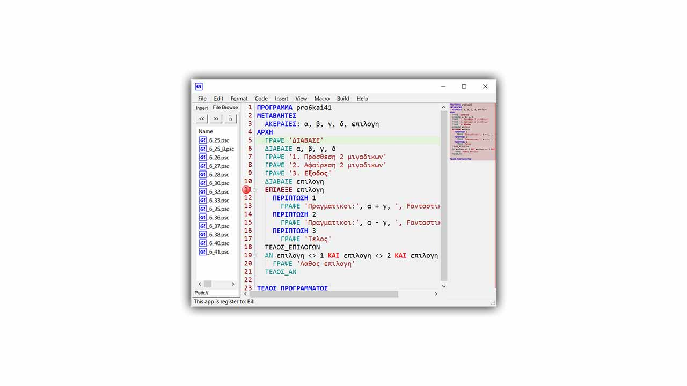
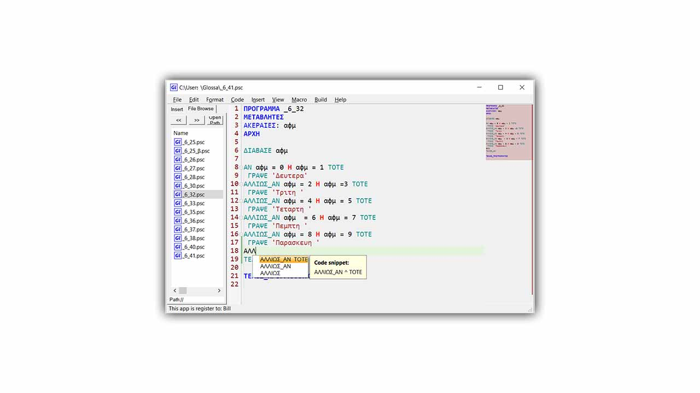
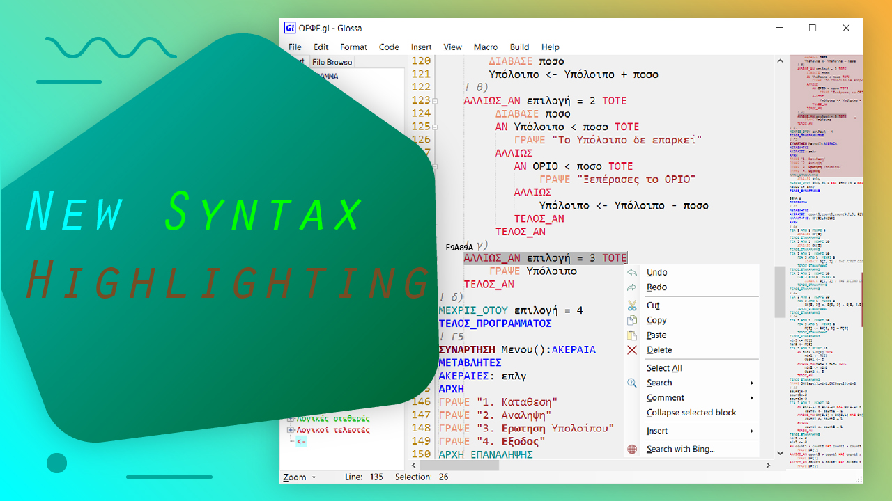
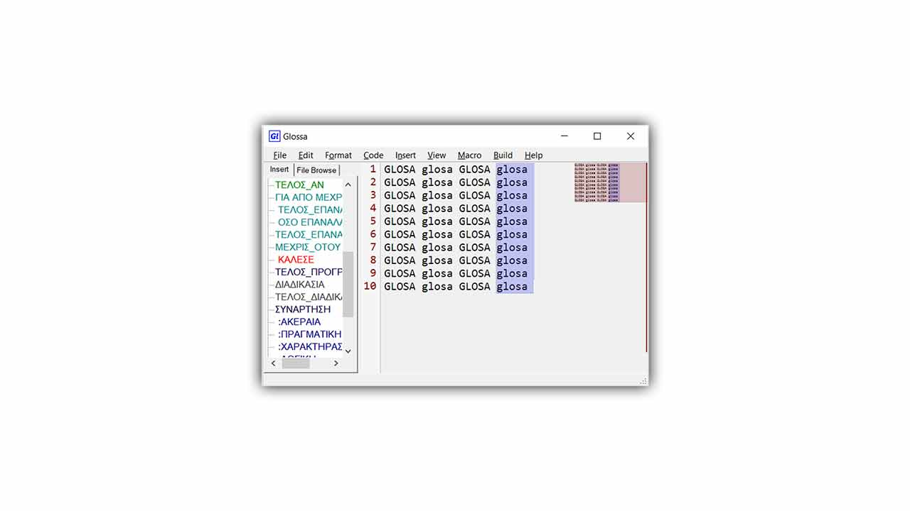
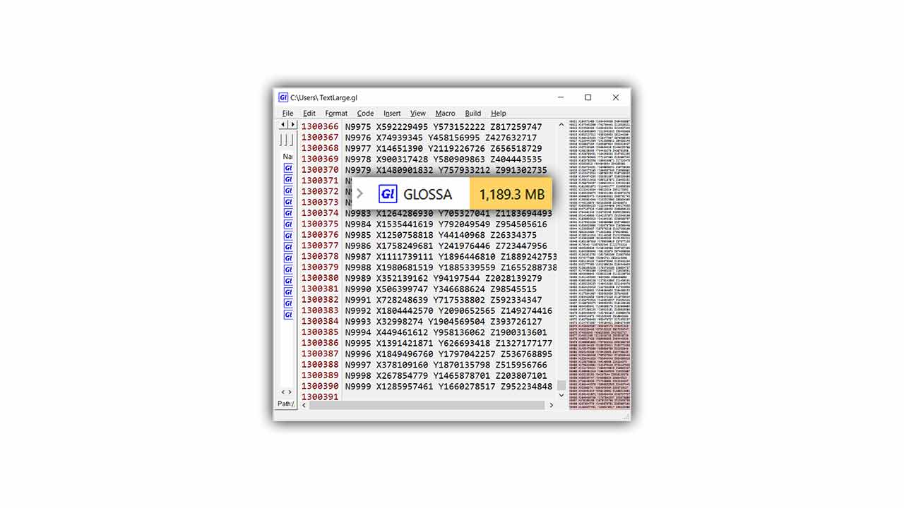

# GLOSSA

Version 2021 v1.3.2.5 (13/3/2021)

Glossa is a code editor for programming Γλώσσα in that is taught in the 3rd grade of senior high school in Greece.

It is already a full-featured GUI application. It is made mainly for educational purposes. Note that does <strong> not have any compiler </strong>.

<h2>Made simple to use and powerful.</h2> 

 

 <h2> Autocomplete menu </h2> 

 <h2> Syntax Highlighting </h2> 

 <h2> Column selection mode </h2> 

 <h2> Very stable at big files like 50mb </h2> 

 <h2> Download (not install): </h2> 

- 
Download ready to run from <a href="https://github.com/bill-chamal/Glossa/releases/download/2021/GLOSSA_no_install.rar">HERE "GLOSSA_no_install"</a><em>.rar</em>

 <h2> Info: </h2> 

- 
Name of the project: "Glossa"

- 
Current version: 2021 v1.3.2.5 (13/3/2021)

- 
It is a code editor for programming only the language "ΓΛΩΣΣΑ".

- 
<a href="https://www.microsoft.com/en-us/download/details.aspx?id=21">Net.Framework 3.5</a>

- 
Size of the project: 4.61 MB (zip) 

<h2>license:</h2>

Author: Bill Chamalidis

Copyright (c). All rights Reserved

This program is free software: you can redistribute it and/or modify
    it under the terms of the <a href="https://www.gnu.org/licenses/gpl-3.0.en.html">GNU</a> General Public License as published by
    the Free Software Foundation, either version 3 of the License, or
    any later version.

